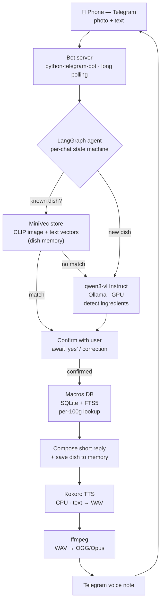

# MacroVoice

A local AI health assistant you talk to from your phone. Send a photo of your food to a Telegram bot; it identifies the ingredients, asks you to confirm, then replies **by voice** with a short macros summary and remembers the dish. Next time you photograph something similar, it asks whether it's the same dish and reuses what it learned.

Everything runs locally on a laptop. The only thing that leaves the machine is Telegram message transport — all inference (vision, speech, embeddings, lookup) happens on-device with no cloud APIs and no per-use cost.

## Pipeline of work

How a single photo becomes a voice reply:



A per-chat state machine drives the conversation through confirmation steps: it proposes ingredients and waits for your "yes" or a correction before computing macros or saving anything. On a new photo it first checks dish memory (MiniVec) — a hit asks "same dish as before?"; a miss runs the vision model.

## Features

- **Photo → ingredients.** A local vision model (qwen3-vl Instruct) returns the most likely ingredients and a rough portion estimate.
- **Confirm before commit.** Nothing is saved until you confirm or correct the ingredient list by text.
- **Voice replies.** Answers come back as natural-sounding Telegram voice notes (Kokoro TTS), not text.
- **Dish memory.** A from-scratch vector store recognizes dishes you've logged before from the photo alone and asks "same as last time?"
- **Macros lookup.** Confirmed ingredients are matched against a local nutrition database (exact → fuzzy → flagged estimate fallback).
- **Fully local & always-on.** Runs as a background service; answers your phone as long as the laptop is on, with no cloud dependency at runtime.

## Stack

| Layer | Tool |
|---|---|
| Transport | Telegram Bot API (long polling) |
| Orchestration | LangGraph state machine |
| Vision | qwen3-vl (Instruct) via Ollama |
| Speech | Kokoro TTS (CPU) → ffmpeg (OGG/Opus) |
| Dish memory | MiniVec — custom numpy vector store, CLIP `clip-ViT-B-32` embeddings |
| Macros | SQLite with FTS5, built from a seed CSV |

Built and tested on a GTX 1050 Ti (4 GB VRAM), Ubuntu 24.04. The vision model is the only GPU tenant (~3.4 GB peak); CLIP and Kokoro run on CPU.

## Requirements

- Linux (tested on Ubuntu 24.04), Python 3.12
- [Ollama](https://ollama.com) running as a service
- `ffmpeg` (system package — for voice-note encoding)
- A Telegram bot token (from [@BotFather](https://t.me/BotFather)) and your numeric Telegram user ID
- An NVIDIA GPU with ~4 GB VRAM recommended (CPU-only will work but vision will be slow)

## Setup

```bash
# 1. System dependency
sudo apt-get install -y ffmpeg

# 2. Clone and create an isolated environment
git clone https://github.com/AliAlhasan6/macrovoice.git
cd macrovoice
python3 -m venv .venv
source .venv/bin/activate
pip install -r requirements.txt   # CPU torch wheel; CLIP/Kokoro run on CPU by design

# 3. Pull the vision model
ollama pull qwen3-vl:4b-instruct

# 4. Build the macros database from the seed CSV (see "Macros data" below)
python scripts/build_macros_db.py

# 5. Configure secrets
cp .env.example .env
# edit .env: set TELEGRAM_TOKEN and ALLOWED_USER_ID
```

> **First run downloads model files.** The first launch fetches the Kokoro voice model and a spaCy English model (used for speech), and the first vision call loads CLIP (~350 MB). These are cached afterward; the first startup will look like it's pausing while they download.

### Run

```bash
.venv/bin/python -m src.bot
```

Message your bot from Telegram (only the configured `ALLOWED_USER_ID` is answered). Send a food photo and follow the voice prompts.

## Running as a service

To keep MacroVoice answering your phone whenever the laptop is on, run it as a user systemd service. A unit file lives at `~/.config/systemd/user/macrovoice.service`.

```bash
systemctl --user enable --now macrovoice   # start now + on login
loginctl enable-linger $USER               # keep running while logged out
systemctl --user status macrovoice         # check state
journalctl --user -u macrovoice -f         # follow logs
systemctl --user stop macrovoice           # stop
```

The service does not declare an Ollama dependency: on startup the bot polls `OLLAMA_URL/api/tags` for up to ~30s, so it tolerates Ollama not being ready yet (e.g. both coming up at boot) and exits with a clear message if Ollama never responds. Ollama runs as a system service and starts at boot independently.

> Only one instance may poll a given bot token at a time. If you see a Telegram `Conflict: terminated by other getUpdates` error, a second copy of the bot is running — stop it (`pkill -f src.bot`) and restart the service.

## Macros data

The nutrition database is built locally from `data/macros_seed.csv` — a compiled set of common foods with per-100g values (kcal, protein, fat, carbs). The included seed values are **approximate reference figures** (tagged `starter_approx` in the `source` column), suitable for a tracker that speaks rounded numbers ("about 450 calories"). They are not exact transcriptions of any single published table.

To use authoritative values, replace or extend rows in the CSV with figures from a reference of your choice (e.g. the Skurikhin/Tutelyan tables for Russian foods) and set the `source` column accordingly, then rebuild:

```bash
python scripts/build_macros_db.py
```

The built database (`data/macros.sqlite`) is **not** committed — only the seed CSV and build script are, so anyone cloning rebuilds their own.

## Privacy

- The bot answers only a single whitelisted Telegram user ID; all other messages are ignored.
- Food photos are EXIF-stripped on save (removes any embedded GPS location).
- Personal data — your photos, dish history, and conversation state — lives only under `data/` and is never committed.
- Secrets live only in `.env` (gitignored); only `.env.example` with placeholders is in the repo.

## Limitations

- Vision and macros are estimates. The local vision model can mislabel mixed dishes or return near-duplicate ingredients; portion sizes are rough guesses you can correct.
- Voice replies are English (the TTS model's strongest voices). Food names are transliterated so they're pronounced reasonably.
- One dish per photo (multi-dish plates are on the roadmap).
- Single user; no daily totals or meal log yet (planned).

## Roadmap

- Multi-dish plates: detect and log several dishes from one photo
- Eval harness to measure ingredient-detection accuracy and dish-match precision/recall
- Ground the free-text Q&A path so it answers from actual state rather than guessing
- Russian TTS and bilingual replies
- Daily totals and a queryable meal log ("what did I eat today?")
- Optional fully-private transport (Tailscale + local web UI)
- Approximate-nearest-neighbor (HNSW) indexing in MiniVec

## License

MIT — see `LICENSE`.
